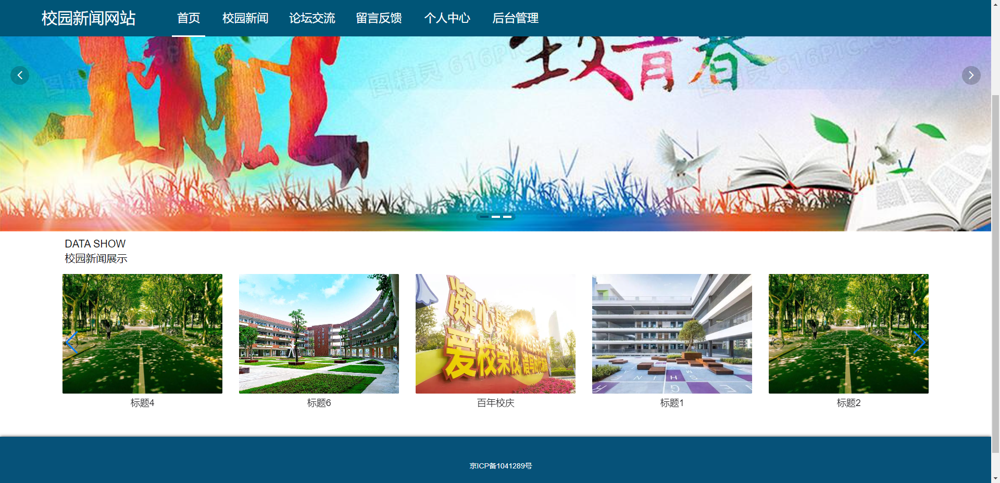
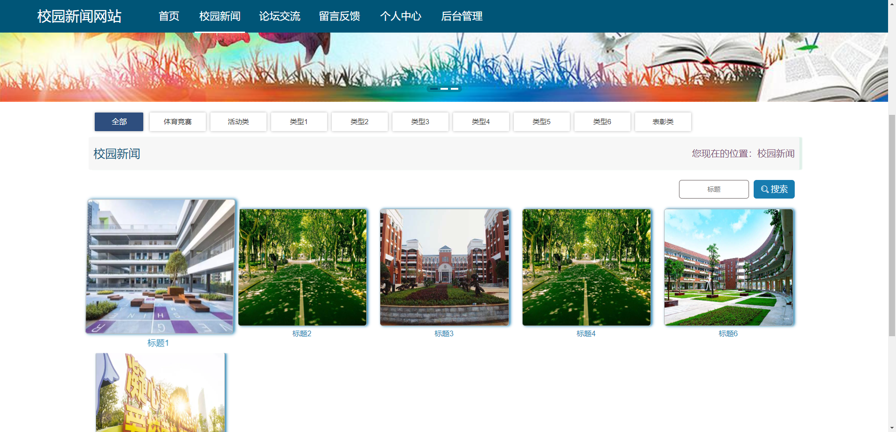
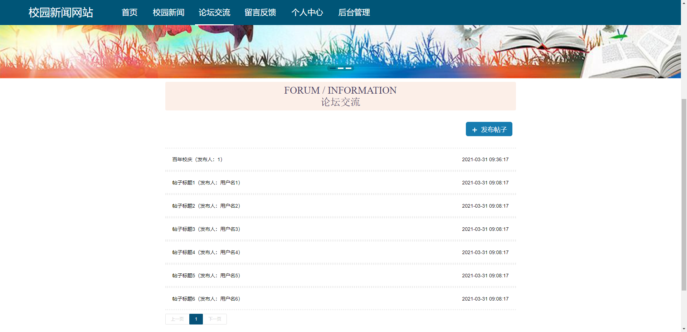
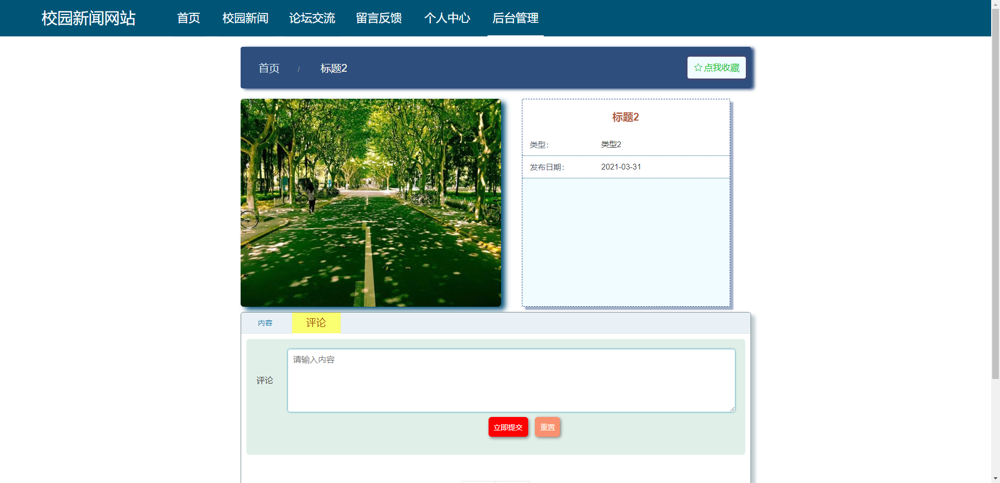
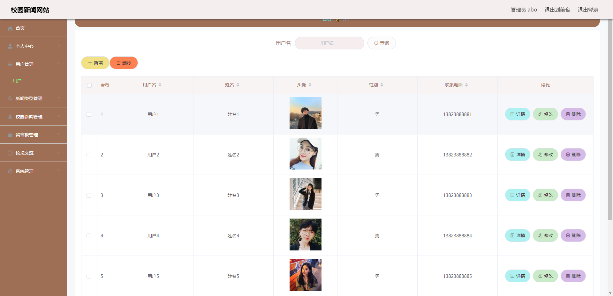
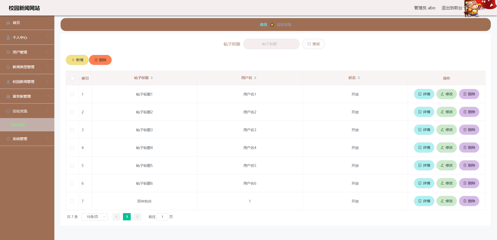
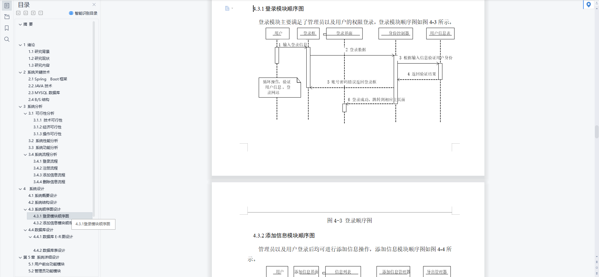
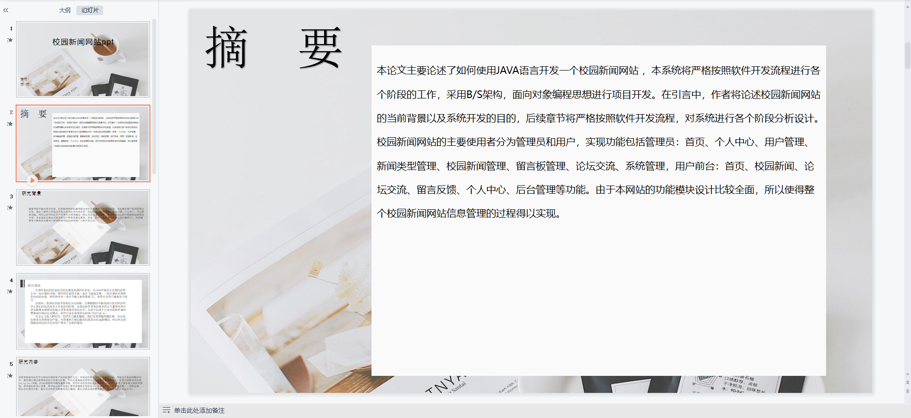
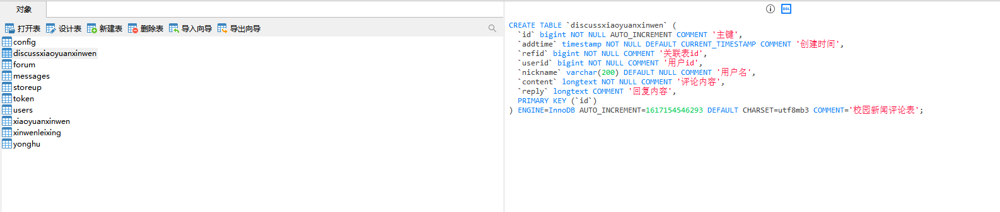

# 1 项目介绍
基于SSM+Vue的校园新闻网站：后端 SpringBoot、Mybatis-Plus，前端Vue+ElementUI，具体功能如下：
## 管理端
- 个人中心：查看和修改个人信息
- 用户管理
- 新闻类型管理
- 校园新闻管理
- 留言板管理
- 论坛交流管理
- 轮播图管理
## 用户端
- 个人中心
- 浏览校园新闻：查看校园新闻列表，详情。收藏和评论新闻
- 论坛交流：发布帖子、浏览帖子列表、查看帖子详情、评论帖子
- 留言反馈
- 后台管理：管理个人信息、收藏信息
# 2 系统运行截图
## 2.1 用户登录

## 2.2 客房信息管理

## 2.3 客房预订管理

## 2.4 入住登记管理

## 2.5 服务费用管理

## 2.6 客房服务

## 2.7 客房信息

## 2.8 万字论文

## 2.9 PPT

# 3 数据库设计

# 4 源码数据库获取(收费)

